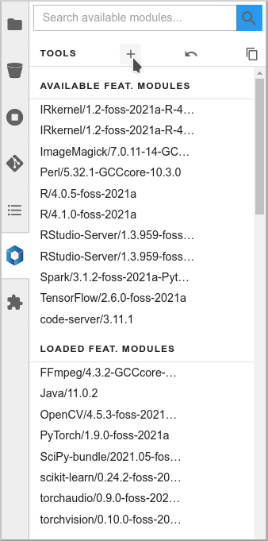
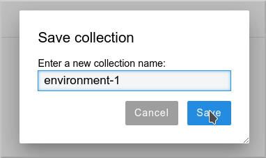
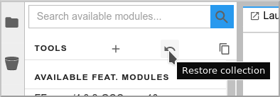
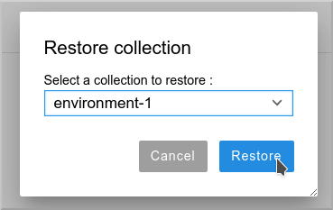
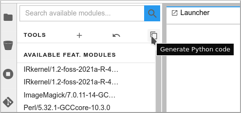
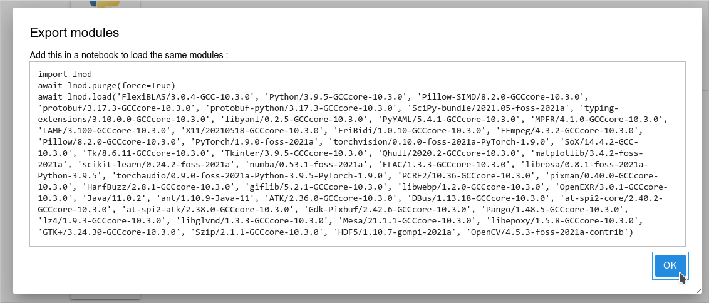

# Advanced functions

## Collections

If you want to create a specific environment with a set of different modules that you want to use, you don't need to recreate this from scratch every time! You can simply load those modules, then create a **Collection**. Next time, you can just restore this collection in two clicks.

### Create a collection

To create a collection, load the modules you want, click on the icon and give a name to the collection.

### Load a collection

When you want to bring back this environment, just click on the Restore icon, and select and load your collection.

## Imports

You can also directly work from your notebooks and your scripts to load the modules that you need. To know which modules you have to use, you can directly export the relevant Python code!

Click on the **Generate Python code** icon:

You can then copy/paste the full code in you first notebook cell or in your script:

!!! note "Don't forget!"
    Of course, for this to work in your notebook or your script, the container image or environment you are using must be "lmod-enabled", and the library with the relevant modules must be accessible/mounted into this environment.
