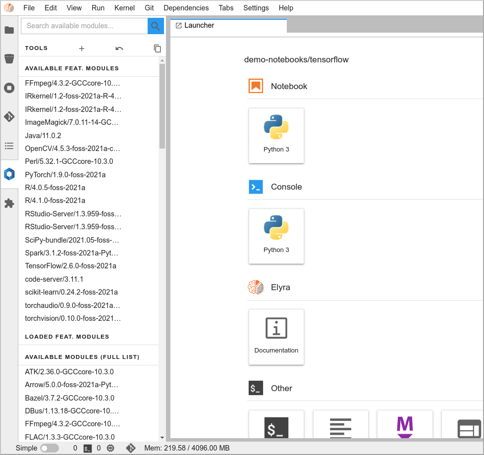
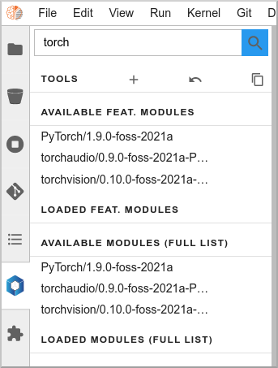
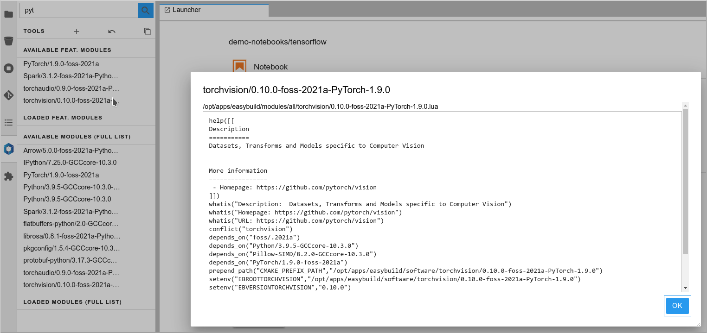
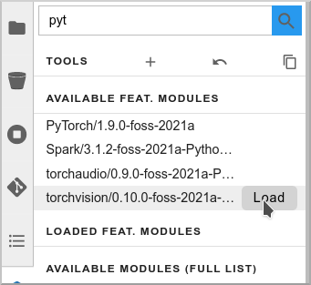
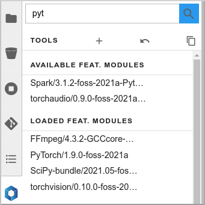
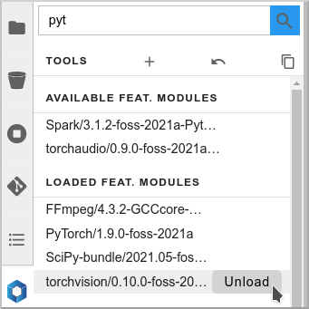

# Basic usage

The JupyterLab extension for Highlander allows you to quickly search for, load or unload libraries and applications.

Within JupyterLab you have access to a new extension on the left menu, called "Softwares". Here are basic instructions on how to use it.

The modules (applications or libraries) are splitted into two main categories: the **featured** modules, and all the **available** modules:

For each category, you can see which modules are available and loaded.

## Search for a module

You can use the filter box to search for a specific module (just enter a few letters). Filtering happens simultaneously on both lists:

If you click on a module name, a pop-up will give you more information: description, dependencies,…​

## Load a module

To load a module, hover on it and click on the "Load" button:

The module and all its dependencies is automatically loaded (torchvision in this example):

## Unload a module

To unload a module, hover it the "loaded" list, and click "Unload":

The module and its dependencies will be automatically unloaded.

!!! note "Good to know!"
    Lmod keeps track of the loaded dependencies for each module. If two different modules share dependencies, a module unloading won’t affect the other one, its dependencies will still be there. There are only unloaded when no module needs them anymore!
