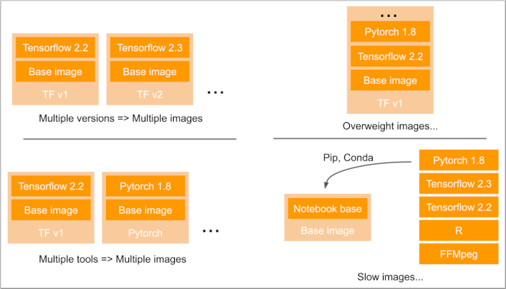

# The problem

When you manage shared data science environments based on Kubernetes on [OpenShift](https://www.redhat.com/en/technologies/cloud-computing/openshift), like [Open Data Hub](http://opendatahub.io/) or [OpenShift Data Science](https://www.redhat.com/en/technologies/cloud-computing/openshift/openshift-data-science), you may face a **container image management problem**.

That is especially true with interactive environments like Jupyter-as-a-Service.

Your users will want to use **various Jupyter images** that include this or **this library or application**, at **this or this specific version**.

Of course it’s clearly impossible to create behemoth images including each and every library you’re asked for, or to create and manage hundreds (thousands?) of variations of handpicked selection of libraries and apps to fit a specific need.

Granted, you could let the users pip or conda install everything from scratch every time they launch the environment. But it’s not that practical, not all packages are available through this mean, especially your own private applications.

Moreover, in an enterprise environment, the as-a-service container won’t run as root, so no package can be yum or apt-get installed.

So you are basically stuck with those different options:

