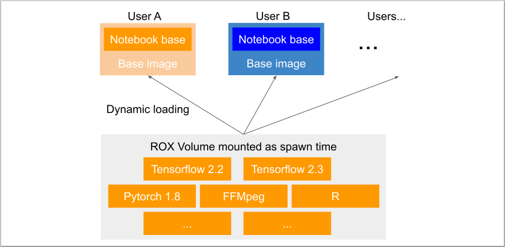

# The solution

This project aims to provide tools and instructions for a different approach to the problem, thanks to the HPC community who has solved it a long time ago! This is kind of a portage of their solution to Kubernetes.

The idea is that instead of building the needed **applications and libraries** into the container images, you can store all of them in a **read-only shared library** on a ROX volume (read-only, but by many pods simultaneously), and mount this volume inside the Pods at spawn time.

Then, leveraging Linux Environment Modules with [Lmod](https://lmod.readthedocs.io/en/latest/), it gets easy to **dynamically "load"** what you need, when you need it, instantly…​ Pretty neat, uh?

This is a very high-level schematic of what's happening:

And with [Easybuild](https://easybuild.io/), you have access to a few thousands of ready to use (or more accurately to compile, we’ll come to that) software packages, plus the full machinery to easily create you owns.
