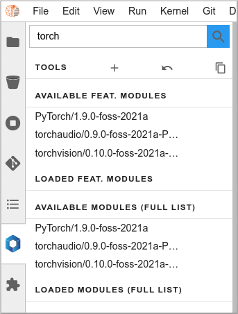
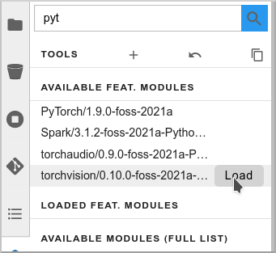
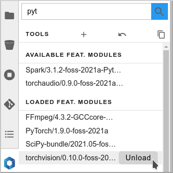
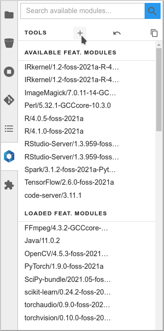
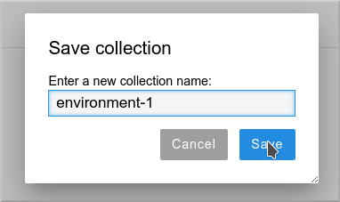
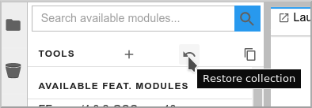
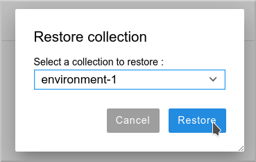

# JupyterLab Extension Usage

## Basic usage

In this JupyterLab instance you have access to a new extension, "Softwares". Here are basic instructions on how to use it.

The list of available modules is splitted in two sections. The "featured" modules, and list](img/lmod_full_list.png)

You can use the filter box to search for a specific module (just enter a few letters). Filtering happens simultaneously on both lists:

If you click on a module name, a pop-up will give you more information: description, dependencies,…​

To load a module, hover on it and click on the "Load" button:

The module and all its dependencies is automatically loaded (torchvision in this example):

To unload a module, hover it the "loaded" list, and click "Unload":

The module and its dependencies will be automatically unloaded.

!!! note "Good to know!"
    Lmod keeps track of the loaded dependencies for each module. If two different modules share dependencies, a module unloading won’t affect the other one, its dependencies will still be there. There are only unloaded when no module needs them anymore!

## Advanced functions

### Collections

If you want to create a specific environment with a set of different modules that you want to use, no need to recreate this from scracth every time! You can simply load those modules, then create a "Collection". Next time, just restore this collection in two clicks.

To create a collection, load the modules you want, click on the icon and give a name to the collection.

When you want to bring back this environment, just click on the Restore icon, and select and load your collection.

### Imports

You can also directly work from your notebooks and your scripts to load the modules that you need. To know which modules you have to use, you can directly export the relevant Python code!

Click on the "Generate Python code" icon:

You can then copy paste the full code in you first notebook cell or in your script:

!!! note "Don't forget!"
    Of course, for this to work in your notebook or your script, the container image or environment you are using must be "lmod-enabled", and the library with the relevant modules must be accessible/mounted into this environment.